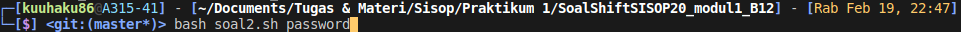
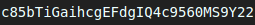
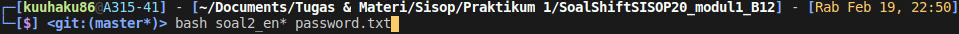
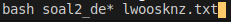
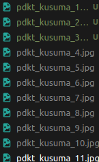
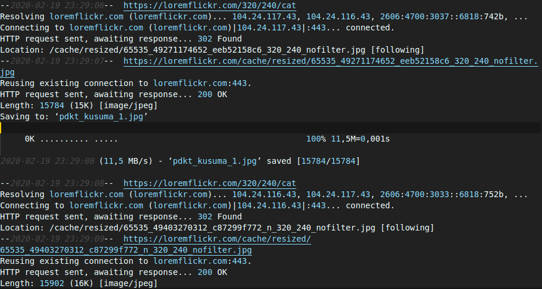
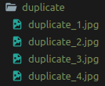
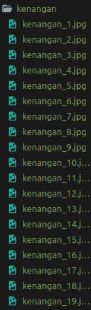
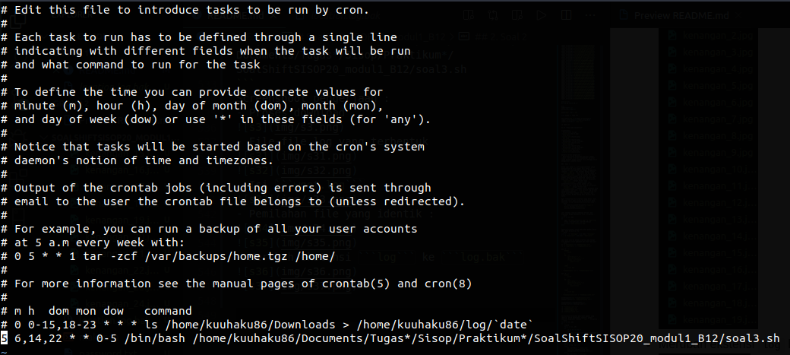

# SoalShiftSISOP20_modul1_B12

## 1. Soal 1
Pada soal 1, kita disuruh untuk membuat suatu script untuk membaca laporan data dari file "Sample-Superstore.csv". Di script itu kita disuruh menganalisis 3 hal, yaitu:
- Tentukan region yang memiliki profit paling sedikit
- Dari hasil sebelumnya, cari 2 state dengan profit paling sedikit
- Tampilkan 10 product name yang memiliki profit paling sedikit berdasarkan hasil analisis sebelumnya
  
Untuk menyelesaikan soal ini, saya menggunakan suatu script bash yang berisi perintah awk dengan pemisah berupa "\t". Di command awk itu, saya menyimpan profit per region, state, dan product name dengan menggunakan array 1 dimensi hingga 3 dimensi.
Di main action kita tinggal menjumlahkan profit di semua array. Lalu di End action kita tinggal melakukan beberapa looping dengan masing-masing array untuk mencari 3 hal yang harus di analisis tersebut.
Berikut main action dari awk :
```bash
  NR > 1{
  reg[$13]=reg[$13]+$21
  sta[$11]
  prod[$17]
  staReg[$11,$13]=staReg[$11,$13]+$21
  staRegProd[$11,$13,$17]=staRegProd[$11,$13,$17]+$21
  }
```

Blok kode untuk mencari region dengan profit terkecil :
```bash
    i=0
    smallest
    smallestReg
    for (a in reg) {
    	if(i==0||smallest>reg[a]){
    		smallest=reg[a]
    		smallestReg=a
    	}
    	i++
    }
    print "Smallest profit region -> " smallestReg
```

Blok kode untuk mencari 2 state dengan profit terkecil :
```bash
  smallestStaProf1=0
  smallestSta1=something
  smallestStaProf=999999999999999
  smallestSta
  i=0
  for (a in sta) {
  	if((i==0 || smallestStaProf > staReg[a,smallestReg]) && staReg[a,smallestReg]!="") {
  		smallestStaProf1=smallestStaProf
  		smallestSta1=smallestSta
  		smallestStaProf=stareg[a,smallestReg]
  		smallestSta=a
  		i++
  	}
  }
  print "Smallest profit states -> " smallestSta " and " smallestSta1
```

Blok kode untuk mencari 10 product name dengan profit terkecil :
```bash
  for(i=1;i<=10;i++){
    arr[i]=999999999999999
    name[i]=""
  }

  for(a in prod) {
  	i=1

  	if(staRegProd[smallestSta,smallestReg,a] != "") {
  		num=staRegProd[smallestSta,smallestReg,a]
  		flag=0
  		
  		for(k=1;k<=10;k++) {
  			if(compareString(name[k],a)==1){
  				if(arr[k]>num) {
  					arr[k]=num
  				}
  				flag=1
  				break
  			}
  		}

  		while(i <= 10 && num > arr[i] && flag==0) {
  			i++
  		}

  		j=9

  		while(j >= i && flag==0){
  			arr[j+1]=arr[j]
  			name[j+1]=name[j]
  			j--
  		}

  		if(i <= 10 && flag==0) {
  			arr[i]=num
  			name[i]=a
  		}
  	}

  	if(staRegProd[smallestSta1,smallestReg,a] != "") {
  		num=staRegProd[smallestSta1,smallestReg,a]
  		flag=0
  		for(k=1;k<=10;k++) {
  			if(compareString(name[k],a)==1){
  				if(arr[k]>num) {
  					arr[k]=num
  				}
  				flag=1
  				break
  			}
  		}

  		while(i <= 10 && num > arr[i] && flag==0) {
  			i++
  		}

  		j=9
  		
  		while(j >= i && flag==0){
  			arr[j+1]=arr[j]
  			name[j+1]=name[j]
  			j--
  		}
  		
  		if(i <= 10 && flag==0) {
  			arr[i]=num
  			name[i]=a
  		}
  	}
  }

  print "Smallest profit products : "
  for(a in name) print name[a]
```

Untuk membandingkan 2 string, saya menggunakan fungsi buatan saya sendiri yang di declare di awk yaitu :
```bash
	function compareString(str1,str2) {
		if(length(str1)!=length(str2)){
			return 0
		}

		split(str1,str11,"")
		split(str2,str22,"")
		
		for(i=0;i<length(str1);i++) {
			if(str11[i]!=str22[i])return 0
		}
		
		return 1
	}
```

Lalu script akan mengeluarkan output :
```bash
Smallest profit region -> Central
Smallest profit states -> Illinois and Texas
Smallest profit products : 
GBC DocuBind P400 Electric Binding System
Ibico EPK-21 Electric Binding System
Lexmark MX611dhe Monochrome Laser Printer
GBC DocuBind TL300 Electric Binding System
3.6 Cubic Foot Counter Height Office Refrigerator
Fellowes PB500 Electric Punch Plastic Comb Binding Machine with Manual Bind
Hoover Upright Vacuum With Dirt Cup
GBC Ibimaster 500 Manual ProClick Binding System
Ibico Hi-Tech Manual Binding System
High Speed Automatic Electric Letter Opener
```
Kendala selama mengerjakan soal :
- Awalnya file sasaran berupa CSV, dan di file tersebut ada data yang mengandung koma (",") sehingga agak mengganggu hasil dari analisis, tapi sekarang sudah dirubah menjadi TSV dan masalah ini selesai.

Screenshoot hasil :


## 2. Soal 2

Soal ke 2 ini memerintahkan kita untuk membuat suatu password generator yang akan menghasilkan password dengan jumlah karakter sebanyak 28 yang berisi huruf besar, huruf kecil, dan angka. Hasil password generator tersebut disimpan di sebuah file berkekstensi txt dengan nama berdasarkan arguman yang diinputkan. Kemudian kita akan membuat suatu script untuk enkripsi nama dari file tersebut dengan menggunakan prinsip caesar cipher, kunci yang digunakan adalah jam dari saat file tersebut dibuat. Lalu kita juga membuat script dekripsi untuk nama file tersebut.

Pertama, kita harus cek apakah argumen hanya mengandung alphabet dengan script :

```bash
    if [[ ! "${str//[A-Za-z]/}" = "" ]] ; then echo "Only alphabet allowed"; exit 1; fi 
```

Untuk membuat password decryptor, saya membuat script yang didalamnya menggunakan bantuan dari fungsi ```$RANDOM``` dari bash. Lalu untuk jam dibuatnya file saya taruh di 2 digit terakhir dari password :


```bash
string=""

capital="ABCDEFGHIJKLMNOPQRSTUVWXYZ"
lower="abcdefghijklmnopqrstuvwxyz"

for (( i=1; i<=28; i++))
do
	number=$(($RANDOM%3))
	case $number in
		0)
			random=$(($RANDOM%10))
			string="$string$random"
		;;

		1)
			random=$(($RANDOM%26))
			string="$string${capital:random:1}"
		;;

		2)
			random=$(($RANDOM%10))
			string="$string${lower:random:1}"
		;;
	esac
done

hour=$(date +%H)

echo "$string$hour" > "$1.txt"

```

Untuk dekripsi dari nama file, saya membutuhkan suatu script untuk mengenerate urutan dari huruf alphabet apabila di geser dengan nama ```maker.sh``` yang berisi : 
```bash
alphabet="abcdefghijklmnopqrstuvwxyz"
ALPHABET="ABCDEFGHIJKLMNOPQRSTUVWXYZ"

for i in {0..25}
do
    # echo ${alphabet:i:1}
    str1=""
    k=$i
    for j in {0..25}
    do
        if [[ k -eq 26 ]]
        then
            k=0
        fi
        str1="$str1${alphabet:k:1}"
        k=$((k+1))
    done
    str2='lower_array['
    str2="$str2$i]=\"$str1\""
    echo $str2
done

for i in {0..25}
do
    # echo ${alphabet:i:1}
    str1=""
    k=$i
    for j in {0..25}
    do
        if [[ k -eq 26 ]]
        then
            k=0
        fi
        str1="$str1${ALPHABET:k:1}"
        k=$((k+1))
    done
    str2='upper_array['
    str2="$str2$i]=\"$str1\""
    echo $str2
done
```
Lalu untuk script enkripsi-nya, saya menggunakan command sed untuk mengganti suatu rangkaian huruf dari suatu teks ke rangkaian huruf yang lain, langkah-nya sebagai berikut :
```bash
lower_array[0]="abcdefghijklmnopqrstuvwxyz"
lower_array[1]="bcdefghijklmnopqrstuvwxyza"
lower_array[2]="cdefghijklmnopqrstuvwxyzab"
lower_array[3]="defghijklmnopqrstuvwxyzabc"
lower_array[4]="efghijklmnopqrstuvwxyzabcd"
lower_array[5]="fghijklmnopqrstuvwxyzabcde"
lower_array[6]="ghijklmnopqrstuvwxyzabcdef"
lower_array[7]="hijklmnopqrstuvwxyzabcdefg"
lower_array[8]="ijklmnopqrstuvwxyzabcdefgh"
lower_array[9]="jklmnopqrstuvwxyzabcdefghi"
lower_array[10]="klmnopqrstuvwxyzabcdefghij"
lower_array[11]="lmnopqrstuvwxyzabcdefghijk"
lower_array[12]="mnopqrstuvwxyzabcdefghijkl"
lower_array[13]="nopqrstuvwxyzabcdefghijklm"
lower_array[14]="opqrstuvwxyzabcdefghijklmn"
lower_array[15]="pqrstuvwxyzabcdefghijklmno"
lower_array[16]="qrstuvwxyzabcdefghijklmnop"
lower_array[17]="rstuvwxyzabcdefghijklmnopq"
lower_array[18]="stuvwxyzabcdefghijklmnopqr"
lower_array[19]="tuvwxyzabcdefghijklmnopqrs"
lower_array[20]="uvwxyzabcdefghijklmnopqrst"
lower_array[21]="vwxyzabcdefghijklmnopqrstu"
lower_array[22]="wxyzabcdefghijklmnopqrstuv"
lower_array[23]="xyzabcdefghijklmnopqrstuvw"
lower_array[24]="yzabcdefghijklmnopqrstuvwx"
lower_array[25]="zabcdefghijklmnopqrstuvwxy"
upper_array[0]="ABCDEFGHIJKLMNOPQRSTUVWXYZ"
upper_array[1]="BCDEFGHIJKLMNOPQRSTUVWXYZA"
upper_array[2]="CDEFGHIJKLMNOPQRSTUVWXYZAB"
upper_array[3]="DEFGHIJKLMNOPQRSTUVWXYZABC"
upper_array[4]="EFGHIJKLMNOPQRSTUVWXYZABCD"
upper_array[5]="FGHIJKLMNOPQRSTUVWXYZABCDE"
upper_array[6]="GHIJKLMNOPQRSTUVWXYZABCDEF"
upper_array[7]="HIJKLMNOPQRSTUVWXYZABCDEFG"
upper_array[8]="IJKLMNOPQRSTUVWXYZABCDEFGH"
upper_array[9]="JKLMNOPQRSTUVWXYZABCDEFGHI"
upper_array[10]="KLMNOPQRSTUVWXYZABCDEFGHIJ"
upper_array[11]="LMNOPQRSTUVWXYZABCDEFGHIJK"
upper_array[12]="MNOPQRSTUVWXYZABCDEFGHIJKL"
upper_array[13]="NOPQRSTUVWXYZABCDEFGHIJKLM"
upper_array[14]="OPQRSTUVWXYZABCDEFGHIJKLMN"
upper_array[15]="PQRSTUVWXYZABCDEFGHIJKLMNO"
upper_array[16]="QRSTUVWXYZABCDEFGHIJKLMNOP"
upper_array[17]="RSTUVWXYZABCDEFGHIJKLMNOPQ"
upper_array[18]="STUVWXYZABCDEFGHIJKLMNOPQR"
upper_array[19]="TUVWXYZABCDEFGHIJKLMNOPQRS"
upper_array[20]="UVWXYZABCDEFGHIJKLMNOPQRST"
upper_array[21]="VWXYZABCDEFGHIJKLMNOPQRSTU"
upper_array[22]="WXYZABCDEFGHIJKLMNOPQRSTUV"
upper_array[23]="XYZABCDEFGHIJKLMNOPQRSTUVW"
upper_array[24]="YZABCDEFGHIJKLMNOPQRSTUVWX"
upper_array[25]="ZABCDEFGHIJKLMNOPQRSTUVWXY"

a=$(cat $1)
# echo $a
b="${a:28:1}${a:29:1}"
# c=$(expr "$b" + 1)
# echo $c

d=$1
name="${d%%.*}"
extension="${d#*.}"

num=$(expr "$b" % 26)

echo $name >> temp.txt

new_name=$(sed "y/${lower_array[0]}${upper_array[0]}/${lower_array[$num]}${upper_array[$num]}/" temp.txt)

rm temp.txt

mv $1 "$new_name.$extension"
```

Untuk script dekrip, kita tinggal memodifikasi sedikit script nya dengan membalik command sed nya, berikut scriptnya :
```bash
lower_array[0]="abcdefghijklmnopqrstuvwxyz"
lower_array[1]="bcdefghijklmnopqrstuvwxyza"
lower_array[2]="cdefghijklmnopqrstuvwxyzab"
lower_array[3]="defghijklmnopqrstuvwxyzabc"
lower_array[4]="efghijklmnopqrstuvwxyzabcd"
lower_array[5]="fghijklmnopqrstuvwxyzabcde"
lower_array[6]="ghijklmnopqrstuvwxyzabcdef"
lower_array[7]="hijklmnopqrstuvwxyzabcdefg"
lower_array[8]="ijklmnopqrstuvwxyzabcdefgh"
lower_array[9]="jklmnopqrstuvwxyzabcdefghi"
lower_array[10]="klmnopqrstuvwxyzabcdefghij"
lower_array[11]="lmnopqrstuvwxyzabcdefghijk"
lower_array[12]="mnopqrstuvwxyzabcdefghijkl"
lower_array[13]="nopqrstuvwxyzabcdefghijklm"
lower_array[14]="opqrstuvwxyzabcdefghijklmn"
lower_array[15]="pqrstuvwxyzabcdefghijklmno"
lower_array[16]="qrstuvwxyzabcdefghijklmnop"
lower_array[17]="rstuvwxyzabcdefghijklmnopq"
lower_array[18]="stuvwxyzabcdefghijklmnopqr"
lower_array[19]="tuvwxyzabcdefghijklmnopqrs"
lower_array[20]="uvwxyzabcdefghijklmnopqrst"
lower_array[21]="vwxyzabcdefghijklmnopqrstu"
lower_array[22]="wxyzabcdefghijklmnopqrstuv"
lower_array[23]="xyzabcdefghijklmnopqrstuvw"
lower_array[24]="yzabcdefghijklmnopqrstuvwx"
lower_array[25]="zabcdefghijklmnopqrstuvwxy"
upper_array[0]="ABCDEFGHIJKLMNOPQRSTUVWXYZ"
upper_array[1]="BCDEFGHIJKLMNOPQRSTUVWXYZA"
upper_array[2]="CDEFGHIJKLMNOPQRSTUVWXYZAB"
upper_array[3]="DEFGHIJKLMNOPQRSTUVWXYZABC"
upper_array[4]="EFGHIJKLMNOPQRSTUVWXYZABCD"
upper_array[5]="FGHIJKLMNOPQRSTUVWXYZABCDE"
upper_array[6]="GHIJKLMNOPQRSTUVWXYZABCDEF"
upper_array[7]="HIJKLMNOPQRSTUVWXYZABCDEFG"
upper_array[8]="IJKLMNOPQRSTUVWXYZABCDEFGH"
upper_array[9]="JKLMNOPQRSTUVWXYZABCDEFGHI"
upper_array[10]="KLMNOPQRSTUVWXYZABCDEFGHIJ"
upper_array[11]="LMNOPQRSTUVWXYZABCDEFGHIJK"
upper_array[12]="MNOPQRSTUVWXYZABCDEFGHIJKL"
upper_array[13]="NOPQRSTUVWXYZABCDEFGHIJKLM"
upper_array[14]="OPQRSTUVWXYZABCDEFGHIJKLMN"
upper_array[15]="PQRSTUVWXYZABCDEFGHIJKLMNO"
upper_array[16]="QRSTUVWXYZABCDEFGHIJKLMNOP"
upper_array[17]="RSTUVWXYZABCDEFGHIJKLMNOPQ"
upper_array[18]="STUVWXYZABCDEFGHIJKLMNOPQR"
upper_array[19]="TUVWXYZABCDEFGHIJKLMNOPQRS"
upper_array[20]="UVWXYZABCDEFGHIJKLMNOPQRST"
upper_array[21]="VWXYZABCDEFGHIJKLMNOPQRSTU"
upper_array[22]="WXYZABCDEFGHIJKLMNOPQRSTUV"
upper_array[23]="XYZABCDEFGHIJKLMNOPQRSTUVW"
upper_array[24]="YZABCDEFGHIJKLMNOPQRSTUVWX"
upper_array[25]="ZABCDEFGHIJKLMNOPQRSTUVWXY"

a=$(cat $1)
b="${a:28:1}${a:29:1}"

d=$1
name="${d%%.*}"
extension="${d#*.}"

num=$(expr "$b" % 26)

echo $name >> temp.txt

new_name=$(sed "y/${lower_array[$num]}${upper_array[$num]}/${lower_array[0]}${upper_array[0]}/" temp.txt)

rm temp.txt

mv $1 "$new_name.$extension"
```
Screenshoot :
- Menjalankan script<br>

- File hasil<br>

- Isi file<br>

- Menjalankan script enkripsi<br>

- Hasil enkripsi<br>

- Menjalankan script dekripsi<br>

- Hasil script dekripsi<br>


Kendala selama pengerjaan :
- Kesulitan dalam melakukan enkripsi caesar cipher, karena cara bash menghandel karakter cukup berbeda dengan bahasa lain sehingga harus menggunakan command khusus

##3. Soal 3

Untuk soal nomor 3, kita diperintahkan untuk mendownload 28 file gambar dari https://loremflickr.com/320/240/cat dengan menggunakan command ```wget``` dan dinamai dengan format ```pdkt_kusuma_NO``` dan hasil log disimpan di file ```wget.log```. Lalu di script itu kita menidentifikasi gambar yang identik dari semua gambar yang berhasil didownload. Apabila ada yang sama, maka taruh salah satu di directory ```duplicate``` dengan format nama ```duplicate_nomor``` dimana nomor itu berdasarkan file ke berapa gambar itu di directory itu. Yang lain di taruh di directory ```kenangan``` dengan format nama ```kenangan_nomor``` dengan aturan penamaan yang sama dengan duplicate. Lalu seluruh log dirubah ekstensinya menjadi ```.log.bak```. Script ini harus dijalankan dengan rutin setiap 8 jam dimulai pukul 06.05 setiap hari kecuali hari sabtu.

Agar terdownload di directory yang benar, beri perintah cd di awal script ke directory yang sekarang. Script berdasarkan directory saya :
```bash
	cd /home/kuuhaku86/Documents/'Tugas & Materi'/Sisop/'Praktikum 1'/SoalShiftSISOP20_modul1_B12
```

Lalu lakukan looping sebanyak 28 kali dan dibarengi dengan penomoran file. Scriptnya :
```bash
for i in {1..28}
do
    wget -O "pdkt_kusuma_$i.jpg" -a "wget.log" https://loremflickr.com/320/240/cat
    arr[$i]="pdkt_kusuma_$i.jpg"
done
```

Apabila directory untuk pemilahan gambar belum ada, buat directory itu :
```bash
[ ! -d "kenangan" ] && mkdir "kenangan"
[ ! -d "duplicate" ] && mkdir "duplicate"
```

Lalu kita cari di dalam directory ada berapa file dengan script gabungan dari bash dan awk :
```bash
ls -l "kenangan" >> "tempKenangan.txt"
ls -l "duplicate" >> "tempDuplicate.txt"

awk -F " " '
    BEGIN{
        max=0
    }
    NR > 1{
        split($9,arr,"_")
        split(arr[2],arrr,".")
        if(max < arrr[1]){
            max=arrr[1]
        
        }
    }END{
        print max
    }
' "tempKenangan.txt" > "tempKenangan2.txt"

awk -F " " '
    BEGIN{
        max=0
    }
    NR > 1{
        split($9,arr,"_")
        split(arr[2],arrr,".")
        if(max < arrr[1]){
            max=arrr[1]
        
        }
    }END{
        print max
    }
' "tempDuplicate.txt" > "tempDuplicate2.txt"

maxKenangan=$(cat "tempKenangan2.txt")
maxDuplicate=$(cat "tempDuplicate2.txt")

maxKenangan=$(($maxKenangan+1))
maxDuplicate=$(($maxDuplicate+1))

rm "tempDuplicate.txt"
rm "tempKenangan.txt"
rm "tempKenangan2.txt"
rm "tempDuplicate2.txt"
```

Selanjutnya melakukan pemilahan gambar yang identik. Untuk mendeteksi apakah 2 gambar identik, digunakan command ```cmp```. Scriptnya :
```bash
for i in {1..28}
do
    flag=0
    for j in {1..28}
    do
        if [[ $i -ne $j ]]
        then
            cmp --silent ${arr[$i]} ${arr[$j]} && flag=1 
        fi
        if [[ $flag -eq 1 ]]
        then
            j=30
        fi
    done
    if [[ $flag -eq 1 ]]
    then
        mv ${arr[$i]} "./duplicate/duplicate_$maxDuplicate.jpg"
        maxDuplicate=$(($maxDuplicate+1))
    else
        mv ${arr[$i]} "./kenangan/kenangan_$maxKenangan.jpg"
        maxKenangan=$(($maxKenangan+1))
    fi
done
```

```wget.log``` isinya disimpan di ```wget.log.bak```. Dan juga dilakukan ```grep``` untuk mendapatkan ```location.log```. Script-nya :
```bash
grep Location "wget.log" > "location.log"
cat "wget.log" >> "wget.log.bak"
rm "wget.log"
mv "location.log" "location.log.bak"
```

Lalu untuk script crontab-nya :

```bash
5 6,14,22 * * 0-5 /bin/bash /home/kuuhaku86/Documents/Tugas*/Sisop/Praktikum*/SoalShiftSISOP20_modul1_B12/soal3.sh
```
Screenshoot pengerjaan :
- Proses download<br>

- File-file log yang terbentuk<br>
<br>

- Isi ```wget.log```<br>

- Pemilahan file yang identik<br>
<br>

- Merubah ekstensi ```log``` ke ```log.bak```<br>
<br>

- Isi dari crontab<br>


Kendala yang dialami selama pengerjaan :
- Tidak mengetahui cara menjalankan script bash di crontab
- Crontab jobs berjalan di directory yang salah
- Harus mengarahkan secara manual crontab jobs di directory yang benar
